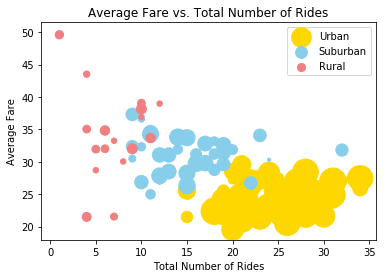
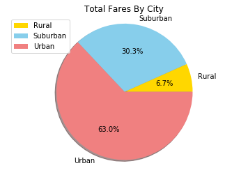
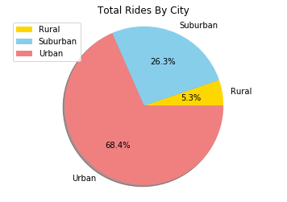
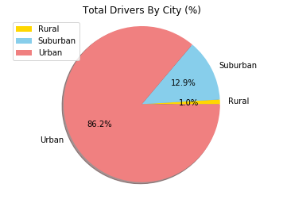

```python
# Import Dependencies
import matplotlib.pyplot as plt
import pandas as pd
import numpy as np
import seaborn as sns
```


```python
# Import data into pandas from CSV
ride_data_df = pd.read_csv("C:/Users/RogStrix/Desktop/Repos/Pyber/ride_data.csv") 
ride_data_df.head()

```


<div>
<style>
    .dataframe thead tr:only-child th {
        text-align: right;
    }

    .dataframe thead th {
        text-align: left;
    }

    .dataframe tbody tr th {
        vertical-align: top;
    }
</style>
<table border="1" class="dataframe">
  <thead>
    <tr style="text-align: right;">
      <th></th>
      <th>city</th>
      <th>date</th>
      <th>fare</th>
      <th>ride_id</th>
    </tr>
  </thead>
  <tbody>
    <tr>
      <th>0</th>
      <td>Sarabury</td>
      <td>2016-01-16 13:49:27</td>
      <td>38.35</td>
      <td>5403689035038</td>
    </tr>
    <tr>
      <th>1</th>
      <td>South Roy</td>
      <td>2016-01-02 18:42:34</td>
      <td>17.49</td>
      <td>4036272335942</td>
    </tr>
    <tr>
      <th>2</th>
      <td>Wiseborough</td>
      <td>2016-01-21 17:35:29</td>
      <td>44.18</td>
      <td>3645042422587</td>
    </tr>
    <tr>
      <th>3</th>
      <td>Spencertown</td>
      <td>2016-07-31 14:53:22</td>
      <td>6.87</td>
      <td>2242596575892</td>
    </tr>
    <tr>
      <th>4</th>
      <td>Nguyenbury</td>
      <td>2016-07-09 04:42:44</td>
      <td>6.28</td>
      <td>1543057793673</td>
    </tr>
  </tbody>
</table>
</div>


```python
city_data_df = pd.read_csv("C:/Users/RogStrix/Desktop/Repos/Pyber/city_data.csv") 
city_data_df.head()
```


<div>
<style>
    .dataframe thead tr:only-child th {
        text-align: right;
    }

    .dataframe thead th {
        text-align: left;
    }

    .dataframe tbody tr th {
        vertical-align: top;
    }
</style>
<table border="1" class="dataframe">
  <thead>
    <tr style="text-align: right;">
      <th></th>
      <th>city</th>
      <th>driver_count</th>
      <th>type</th>
    </tr>
  </thead>
  <tbody>
    <tr>
      <th>0</th>
      <td>Kelseyland</td>
      <td>63</td>
      <td>Urban</td>
    </tr>
    <tr>
      <th>1</th>
      <td>Nguyenbury</td>
      <td>8</td>
      <td>Urban</td>
    </tr>
    <tr>
      <th>2</th>
      <td>East Douglas</td>
      <td>12</td>
      <td>Urban</td>
    </tr>
    <tr>
      <th>3</th>
      <td>West Dawnfurt</td>
      <td>34</td>
      <td>Urban</td>
    </tr>
    <tr>
      <th>4</th>
      <td>Rodriguezburgh</td>
      <td>52</td>
      <td>Urban</td>
    </tr>
  </tbody>
</table>
</div>


```python
city_data_df.drop_duplicates(subset = "city", inplace = True)

```


```python
#Fare Statistics 
avgerage_fare_city = ride_data_df[['city', 'fare']].groupby("city").mean()
total_fare_city = ride_data_df[['city', 'fare']].groupby("city").sum()
rides_count_city = ride_data_df[['city', 'ride_id']].groupby('city').count()
```


```python
#Merge City and Ride Fare 

analysis_df = pd.merge(city_data_df, avgerage_fare_city, left_on = "city", right_index = True)
analysis_df = pd.merge(analysis_df, total_fare_city, left_on = "city", right_index = True)
analysis_df = pd.merge(analysis_df, rides_count_city, left_on = "city", right_index = True)
analysis_df.rename(columns = {"driver_count": "Total Number of Drivers", "type": "City Type", "fare_x": "Average Fare", "fare_y": "Sum of Fares","ride_id": "Total Number of Rides"}, inplace = True)
analysis_df.head()
```


<div>
<style>
    .dataframe thead tr:only-child th {
        text-align: right;
    }

    .dataframe thead th {
        text-align: left;
    }

    .dataframe tbody tr th {
        vertical-align: top;
    }
</style>
<table border="1" class="dataframe">
  <thead>
    <tr style="text-align: right;">
      <th></th>
      <th>city</th>
      <th>Total Number of Drivers</th>
      <th>City Type</th>
      <th>Average Fare</th>
      <th>Sum of Fares</th>
      <th>Total Number of Rides</th>
    </tr>
  </thead>
  <tbody>
    <tr>
      <th>0</th>
      <td>Kelseyland</td>
      <td>63</td>
      <td>Urban</td>
      <td>21.806429</td>
      <td>610.58</td>
      <td>28</td>
    </tr>
    <tr>
      <th>1</th>
      <td>Nguyenbury</td>
      <td>8</td>
      <td>Urban</td>
      <td>25.899615</td>
      <td>673.39</td>
      <td>26</td>
    </tr>
    <tr>
      <th>2</th>
      <td>East Douglas</td>
      <td>12</td>
      <td>Urban</td>
      <td>26.169091</td>
      <td>575.72</td>
      <td>22</td>
    </tr>
    <tr>
      <th>3</th>
      <td>West Dawnfurt</td>
      <td>34</td>
      <td>Urban</td>
      <td>22.330345</td>
      <td>647.58</td>
      <td>29</td>
    </tr>
    <tr>
      <th>4</th>
      <td>Rodriguezburgh</td>
      <td>52</td>
      <td>Urban</td>
      <td>21.332609</td>
      <td>490.65</td>
      <td>23</td>
    </tr>
  </tbody>
</table>
</div>


```python
#Dataframes for graphs

urban_analysis_df = analysis_df[analysis_df['City Type'] == "Urban"]
rural_analysis_df = analysis_df[analysis_df['City Type'] == "Rural"]
suburban_analysis_df = analysis_df[analysis_df['City Type'] == "Suburban"]

```


```python
#Bubbleplot
colors = ['gold', 'skyblue', 'lightcoral']
plt.scatter(x = urban_analysis_df['Total Number of Rides'], y = urban_analysis_df['Average Fare'], 
           s = urban_analysis_df['Total Number of Drivers'] * 10, c = colors[0], label = "Urban")
plt.scatter(x = suburban_analysis_df['Total Number of Rides'], y = suburban_analysis_df['Average Fare'],
           s = suburban_analysis_df['Total Number of Drivers'] * 10, c = colors[1], label = "Suburban")
plt.scatter(x = rural_analysis_df['Total Number of Rides'], y = rural_analysis_df['Average Fare'],
           s = rural_analysis_df['Total Number of Drivers'] * 10, c = colors[2], label = "Rural")
plt.legend()
plt.xlabel("Total Number of Rides")
plt.ylabel("Average Fare")
plt.title("Average Fare vs. Total Number of Rides")

plt.show()
```





```python
FaresTotal = city_data_df.merge(ride_data_df, on='city')

FaresTotal = FaresTotal[["type", "fare"]].groupby("type").sum().round(2).reset_index()
FaresTotal
```


<div>
<style>
    .dataframe thead tr:only-child th {
        text-align: right;
    }

    .dataframe thead th {
        text-align: left;
    }

    .dataframe tbody tr th {
        vertical-align: top;
    }
</style>
<table border="1" class="dataframe">
  <thead>
    <tr style="text-align: right;">
      <th></th>
      <th>type</th>
      <th>fare</th>
    </tr>
  </thead>
  <tbody>
    <tr>
      <th>0</th>
      <td>Rural</td>
      <td>4255.09</td>
    </tr>
    <tr>
      <th>1</th>
      <td>Suburban</td>
      <td>19317.88</td>
    </tr>
    <tr>
      <th>2</th>
      <td>Urban</td>
      <td>40078.34</td>
    </tr>
  </tbody>
</table>
</div>


```python
RidesTotal = ride_data_df.merge(city_data_df, on='city')

RidesTotal = RidesTotal[["type", "ride_id"]].groupby("type").count().reset_index()
RidesTotal
```


<div>
<style>
    .dataframe thead tr:only-child th {
        text-align: right;
    }

    .dataframe thead th {
        text-align: left;
    }

    .dataframe tbody tr th {
        vertical-align: top;
    }
</style>
<table border="1" class="dataframe">
  <thead>
    <tr style="text-align: right;">
      <th></th>
      <th>type</th>
      <th>ride_id</th>
    </tr>
  </thead>
  <tbody>
    <tr>
      <th>0</th>
      <td>Rural</td>
      <td>125</td>
    </tr>
    <tr>
      <th>1</th>
      <td>Suburban</td>
      <td>625</td>
    </tr>
    <tr>
      <th>2</th>
      <td>Urban</td>
      <td>1625</td>
    </tr>
  </tbody>
</table>
</div>


```python
DriversTotal = city_data_df.merge(ride_data_df, on='city')

DriversTotal = DriversTotal[["type", "driver_count"]].groupby("type").sum().round(2).reset_index()
DriversTotal
```


<div>
<style>
    .dataframe thead tr:only-child th {
        text-align: right;
    }

    .dataframe thead th {
        text-align: left;
    }

    .dataframe tbody tr th {
        vertical-align: top;
    }
</style>
<table border="1" class="dataframe">
  <thead>
    <tr style="text-align: right;">
      <th></th>
      <th>type</th>
      <th>driver_count</th>
    </tr>
  </thead>
  <tbody>
    <tr>
      <th>0</th>
      <td>Rural</td>
      <td>727</td>
    </tr>
    <tr>
      <th>1</th>
      <td>Suburban</td>
      <td>9634</td>
    </tr>
    <tr>
      <th>2</th>
      <td>Urban</td>
      <td>64501</td>
    </tr>
  </tbody>
</table>
</div>


```python
#(%) of Total Fares by City
TotalFarePie = FaresTotal['fare']
labels='Rural', 'Suburban', 'Urban'
plt.pie(TotalFarePie, colors = colors, labels=labels, autopct='%1.1f%%', shadow=True)
plt.axis('equal')
plt.title('Total Fares By City')
plt.legend()
plt.show()
```





```python
#(%) of Total Rides by City
totalRideChart = RidesTotal['ride_id']
labels='Rural', 'Suburban', 'Urban'
plt.pie(totalRideChart, colors = colors, labels=labels, autopct='%1.1f%%', shadow=True)
plt.axis('equal')
plt.title('Total Rides By City')
plt.legend()
plt.show()
```





```python
#(%) of Total Drivers By City 
TotalDriversPie = DriversTotal['driver_count']
labels='Rural', 'Suburban', 'Urban'
plt.pie(TotalDriversPie, colors = colors, labels=labels, autopct='%1.1f%%', shadow=True)
plt.axis('equal')
plt.title('Total Drivers By City (%)')
plt.legend()
plt.show()
```




